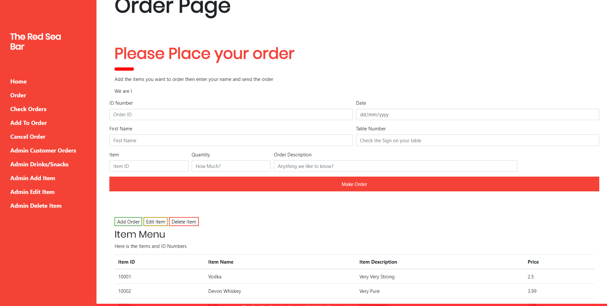

# ISAD251
Database Assignment
# Application fact sheet
The Application Called "The Red Sea Bar",  is an application that allows a user to order food/drinks from a menu and be able to view what they ordered. The admin using this application can look at the orders and items and be able to edit/add or delete these items. This application has 9 features:

* Order a drink/food
* A customer can view their order
* Add to an order
* Cancel an order
* Add an Item 
* Edit an Item
* Admin can view Orders
* Admin and user can view items
* withdraw a drink/snack from sale

# Video Link
https://www.youtube.com/watch?v=WAhdTqKlqMA&feature=youtu.be

# 3rd party Images Used
Image 1 & 2: https://upserve.com/restaurant-insider/liquor-license/

Image 3: https://smeloans.co.uk/assets/media-library/images/modern-loft-bar-1000.jpg

Image 4: https://cdn10.phillymag.com/wp-content/uploads/2016/09/MO-best-bars-a-bar-ted-nghiem-940.jpg

#Images Of the Applications Pages
# Home

# Order

# AddOrder

# AllOrders

# AllItems

# DeleteItem

# EditItem

# CancelOrder

# WAI
This the result I got from putting the application though the WAI

# GoogleChrome

# FireFox

