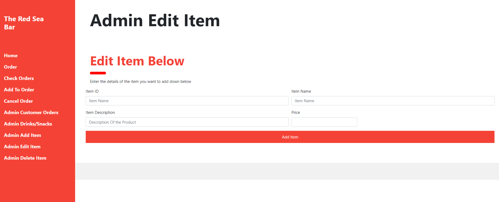

# ISAD251
Database Assignment
#Application fact sheet

# Video Link

# 3rd party Images Used
Image 1 & 2: https://upserve.com/restaurant-insider/liquor-license/

Image 3: https://smeloans.co.uk/assets/media-library/images/modern-loft-bar-1000.jpg

Image 4: https://cdn10.phillymag.com/wp-content/uploads/2016/09/MO-best-bars-a-bar-ted-nghiem-940.jpg

#Images Of the Applications Pages
# Home

# Order

# AddOrder

# AllOrders.PNG

# DeleteItem.PNG

# EditItem.PNG

# CancelOrder.PNG

# FireFox.PNG

